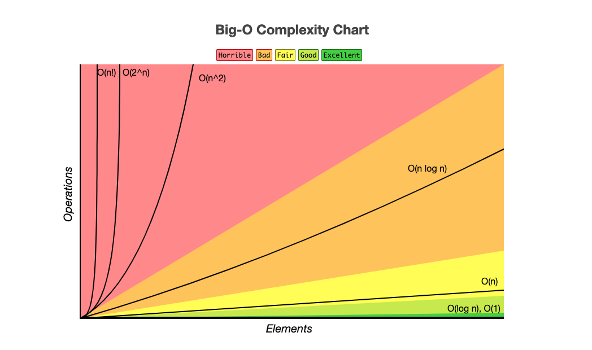
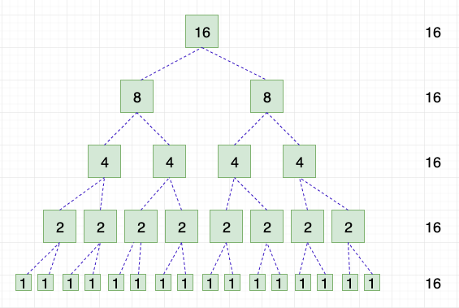

# Introdução à Complexidade de Algoritmos

## Referencia Bibliográfica:

- [Medium: Wilder Pereira - Introdução à Complexidade de Algoritmos](https://medium.com/nagoya-foundation/introdu%C3%A7%C3%A3o-%C3%A0-complexidade-de-algoritmos-4a9c237e4ecc)
- [dev.to: Wagner Abrantes - Big O Notation Series' Articles](https://dev.to/vapordev/series/9239)

## Clasificar Algoritmos

Para saber qual é o melhor algoritimo para usar, antes temos que classificar os problemas por categorias/técnicas, algumas das principais são:

- Greedy Algorithms
- Dynamic Programming
- Divide and conquer
- Backtracking
- Search and Sorting

Existem também Estrutura de Dados que são utilizados nessas e outras técnicas para ajudar na eficiência desses algoritmos. Como por exemplo: 

- Grafos
- Árvores
- Heaps
- Tabelas Hash
- Pilhas
- Filas

## Tipos de Algoritimos

**OBS: todos os exemplos com array de tamanho 1.024.**

[O(1)](./O-1.js)  
Lê apenas uma vez o código **(1)**

[O(n)](./O-n.js)  
Lê o número de vezes o código **(1.024)**

[O(n²)](./O-n-squared.js)  
1.024^2 = 1.024 * 1.024 = **(1.048.576)**

[Busca Binária - O(log n) tempo e O(1) espaço.](busca-binaria.js)  
- Tempo: O(log n) = log_2(1.024) = **(10)**
- Espaço: O(1) = **(1)**

[Merge Sort — O(n log n) tempo e O(n) espaço.](merge-sort.js)  
- Tempo: O(n log n) = log_1.024(1.024) = **(3082)**
- Espaço: O(n) = **(1024)**

O algoritmo Merge Sort utiliza a técnica Divide and Conquer. Durante sua execução, o array de entrada é dividido em duas metades, e a função mergeSort é chamada recursivamente para cada uma delas, intercalando as duas metades de forma ordenada no final.

